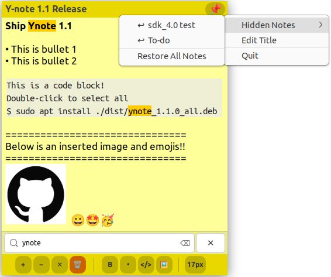

# Ynote

Engineer-friendly sticky notes for Linux desktops.



Ynote is a lightweight GTK desktop notes app for Ubuntu and GNOME-based Linux systems.
It is built for the kind of notes engineers keep beside their editor: command/code snippets,
debugging context, screenshots, and reminders that should always stay visible.

## Origin

Ynote started from a practical need while working as an embedded software
engineer: I needed a sticky note app for Ubuntu to handle the kinds of
notes engineers keep beside their editor. I could not find one that fit that
workflow well, so I built Ynote with help from Codex and Claude.

## Highlights

- Floating desktop notes with automatic local saving
- Always-on-top pinning for notes you need beside your editor
- Rich text basics: bold text, bullet lists, undo/redo, and per-note font size
- Code blocks for commands and snippets
- Image insertion and image paste support
- Search inside a note
- Hide notes and restore them later from the tray/menu

## Potential improvements To-do
- Split ynote.py into modules (app.py, note_window.py, storage.py, images.py, formatting.py)
- Add automated tests, especially for storage and text-state logic
    - The current code has a high risk of regressions due to the lack of tests and the complexity of the note state management


## Install

### Debian Package

Build the package:

```bash
./build-deb.sh
```

Install the generated package:

```bash
sudo apt install ./dist/ynote_1.1.0_all.deb
```

Run Ynote:

```bash
ynote
```

### Manual Install

For local testing, you can also install from the checkout:

```bash
./install.sh
```

The packaged `.deb` is recommended for normal use because it installs the
launcher, desktop entry, and icon in standard system locations.

## Requirements

Ynote uses Python, GTK 3, and PyGObject.

On Ubuntu/Debian:

```bash
sudo apt install python3 python3-gi gir1.2-gtk-3.0
```

### Wayland and GNOME Notes

Ynote is designed for Ubuntu/GNOME desktops and currently runs through GTK 3's
X11 backend, even when launched from a Wayland session.

This is intentional. Some sticky-note behaviors that Ynote relies on, such as
precise window positioning, always-on-top notes, tray/status-icon behavior, and
raising/lowering note windows, are more reliable under X11/XWayland than native
Wayland.

When Ynote detects a Wayland session, it automatically restarts itself with:

## Data Location

Notes are stored locally in:

```text
~/.config/ynote/
```

The app keeps note text in `notes.json` and stores inserted images under the
same config directory.

## Development

Run directly from the repository:

```bash
python3 ynote.py
```

Build a fresh Debian package:

```bash
./build-deb.sh
```

The package metadata lives in `packaging/debian/`, and the desktop launcher is
defined in `packaging/ynote.desktop`.

## License

Ynote is released under the MIT License. See [LICENSE](LICENSE).
