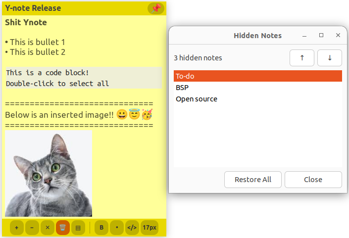
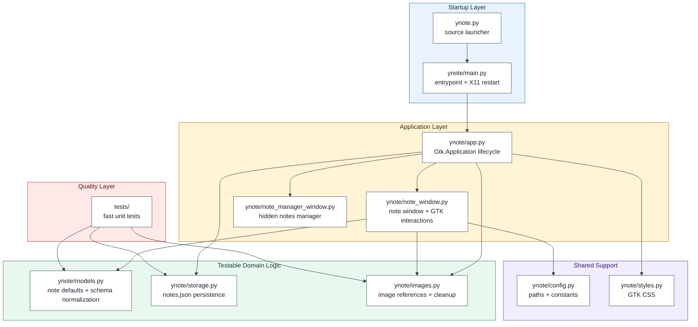

# Ynote

Engineer-friendly sticky notes for Linux desktops.



Ynote is a lightweight GTK desktop notes app for Ubuntu and GNOME-based Linux systems.
It is built for the kind of notes engineers keep beside their editor: command/code snippets,
debugging context, screenshots, and reminders that should always stay visible.

## Origin

Ynote started from a practical need while working as an embedded software
engineer: I needed a sticky note app for Ubuntu to handle the kinds of
notes engineers keep beside their editor. I could not find one that fit that
workflow well, so I built Ynote with help from Codex and Claude.

## Highlights

- Floating desktop notes with automatic local saving
- Always-on-top pinning for notes you need beside your editor
- Rich text basics: bold text, bullet lists, undo/redo, and per-note font size
- Code blocks for commands and snippets
- Image insertion from the text context menu and image paste support
- Search inside a note
- Hidden notes manager with manual ordering and double-click restore

## Usage Notes

- Use the `▤` toolbar button or the tray menu to open the hidden notes manager.
- Use `↑` / `↓` in the hidden notes manager to order hidden notes.
- Double-click a hidden note in the manager to restore it.
- Right-click inside a note to insert an image from the text context menu.
- Use `Ctrl+8` to toggle bullet-list formatting.

## Architecture

Ynote is organized as a small GTK desktop application with clear boundaries
between process startup, application orchestration, window/UI behavior,
persistence, and testable domain logic.

### Module structure

This diagram shows how source files are grouped by responsibility. Runtime GTK
code lives in the application layer, while persistence, image rules, and note
schema rules live in pure Python modules that can be tested without opening a
desktop window.



The design keeps desktop-specific GTK code in `note_window.py` and `app.py`,
while moving persistence, image lifecycle, and note-data rules into pure Python
modules. Those pure modules are covered by fast unit tests, so regressions in
saved-note compatibility, image cleanup, and JSON persistence can be caught
without requiring a graphical desktop session.

### Save and Image Cleanup Flow

This diagram shows what happens when Ynote saves notes. `PostItApp.save_all()`
collects the current state from every live `NoteWindow`, writes that state to
`notes.json`, and keeps image files that are still referenced by current notes
or runtime undo/redo history. Internally, `save_all()` calls `w.to_dict()` and
`w.history_image_files()` for each live note window.

```mermaid
flowchart LR
    subgraph Runtime["Runtime State"]
        Windows["Live note windows<br/>(NoteWindow objects)"]
    end

    subgraph SaveCoord["Save Coordination"]
        SaveAll["Save coordinator<br/>(PostItApp.save_all())"]
        Serializer["Note serializer<br/>(w.to_dict())"]
        HistoryCollector["History image collector<br/>(w.history_image_files())"]
        ReferenceSet["Image reference set<br/>(referenced_image_files())"]
    end

    subgraph Persistence["Local Persistence"]
        NotesWriter["Notes file writer<br/>(save_notes())"]
        ImageCleaner["Image cleanup worker<br/>(cleanup_orphaned_images())"]
        NotesFile[("Notes JSON file<br/>~/.config/ynote/notes.json")]
        ImagesDir[("Copied images directory<br/>~/.config/ynote/images/")]
    end

    Windows -->|"live windows"| SaveAll
    SaveAll -->|"calls"| Serializer
    SaveAll -->|"calls"| HistoryCollector
    Serializer -->|"note dict list"| NotesWriter
    NotesWriter -->|"writes notes JSON"| NotesFile
    Serializer -->|"current image refs"| ReferenceSet
    HistoryCollector -->|"history image refs"| ReferenceSet
    ReferenceSet -->|"referenced filenames"| ImageCleaner
    ImagesDir -->|"copied image files"| ImageCleaner
    ImageCleaner -->|"removes orphan files"| ImagesDir

    classDef data fill:#FFFFFF,stroke:#4A5568,stroke-width:1px,color:#1A202C

    class Windows,SaveAll,Serializer,HistoryCollector,ReferenceSet,NotesWriter,NotesFile,ImageCleaner,ImagesDir data

    style Runtime fill:#E8F3FF,stroke:#2F6FAB,stroke-width:1px,color:#102A43
    style SaveCoord fill:#E8F8EF,stroke:#2F855A,stroke-width:1px,color:#143C2B
    style Persistence fill:#FFF4D6,stroke:#B7791F,stroke-width:1px,color:#3D2C00
```



Diagram notes:

- `Note serializer` returns the current note dictionaries by using `w.to_dict()`.
- `History image collector` returns image references still reachable through undo/redo history.
- Image cleanup keeps every referenced filename and removes only orphaned copied image files.

| Area | Module | Responsibility |
| --- | --- | --- |
| Entrypoint | `ynote.py`, `ynote/main.py` | Preserve `python3 ynote.py` source-checkout execution and handle Wayland-to-X11 restart behavior |
| Application | `ynote/app.py` | Own the GTK application lifecycle, tray menu, note collection, hidden-note ordering, save coordination, and shutdown |
| Window/UI | `ynote/note_window.py` | Build and manage note windows, text editing, shortcuts, search, text context-menu actions, and window behavior |
| Hidden notes manager | `ynote/note_manager_window.py` | List hidden notes, restore notes, and reorder hidden notes through a dedicated GTK window |
| Data model | `ynote/models.py` | Normalize saved note data and preserve backward-compatible defaults |
| Persistence | `ynote/storage.py` | Load and save `notes.json` with atomic replacement |
| Images | `ynote/images.py` | Normalize image metadata, track references, and remove orphaned copied images |
| Styling/config | `ynote/styles.py`, `ynote/config.py` | Keep GTK CSS, paths, IDs, and shared constants out of application logic |
| Tests | `tests/` | Cover pure logic without requiring a graphical desktop session |

`ynote.py` remains as a small source launcher that imports `ynote.main`. This
keeps existing manual installs and the `python3 ynote.py` development workflow
working after the implementation moved into the `ynote/` package. The Debian
package builder installs both the launcher and the package modules.

## Install

### Debian Package

Build the package:

```bash
./build-deb.sh
```

Install the generated package:

```bash
sudo apt install ./dist/ynote_1.3.0_all.deb
```

Run Ynote:

```bash
ynote
```

### Manual Install

For local testing, you can also install from the checkout:

```bash
./install.sh
```

The packaged `.deb` is recommended for normal use because it installs the
launcher, desktop entry, and icon in standard system locations.

## Requirements

Ynote uses Python, GTK 3, and PyGObject.

On Ubuntu/Debian:

```bash
sudo apt install python3 python3-gi gir1.2-gtk-3.0
```

### Wayland and GNOME Notes

Ynote is designed for Ubuntu/GNOME desktops and currently runs through GTK 3's
X11 backend, even when launched from a Wayland session.

This is intentional. Some sticky-note behaviors that Ynote relies on, such as
precise window positioning, always-on-top notes, tray/status-icon behavior, and
raising/lowering note windows, are more reliable under X11/XWayland than native
Wayland.

When Ynote detects a Wayland session, it automatically restarts itself with the
X11 backend enabled.

## Data Location

Notes are stored locally in:

```text
~/.config/ynote/
```

The app keeps note text in `notes.json` and stores inserted images under the
same config directory.

## Development

Run directly from the repository:

```bash
python3 ynote.py
```

Run the test and packaging checks:

```bash
./test.sh
```

Build a fresh Debian package:

```bash
./build-deb.sh
```

The package metadata lives in `packaging/debian/`, and the desktop launcher is
defined in `packaging/ynote.desktop`.

## Future Improvements

- Extract more text-buffer behavior from the GTK layer for deeper automated testing
- Add focused tests for code block, bullet list, and undo/redo state transitions
- Continue improving packaging and desktop integration across GNOME environments

## License

Ynote is released under the MIT License. See [LICENSE](LICENSE).
